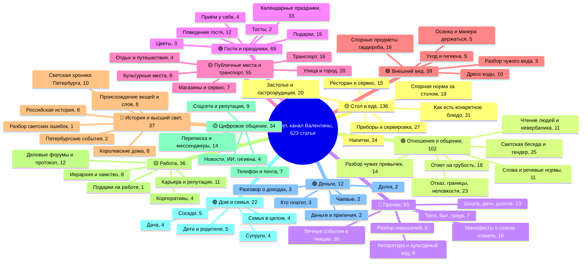

# Майндмап освещённых тем канала «Валентина Хлистун | Этикет»

**Дата:** 26 июля 2026

**Источник данных:** `data/статьи_с_разметкой.csv` — 623 статьи из выгрузки Дзен-Студии
за период 28.03.2023 — 24.07.2026 (показы, открытия, дочитывания, лайки, комментарии,
подписки) плюс ручная разметка заголовков вслепую по кодбуку (сцена, функция, порог входа,
фокус, спорность и др.). Полные тексты 620 статей, собранные с Дзена 26.07.2026, использованы
для проверки принадлежности статьи к подтеме.

**Как считалось:** сцены (11 штук) взяты из готовой разметки. Подтемы внутри сцены собраны
по ключевым словам заголовков и проверены глазами по полному списку из 623 названий.
Везде, где стоит число, — это фактический счёт статей или медиана из выгрузки.
Средним арифметическим не пользуемся нигде: одна статья канала даёт 48 млн показов
и портит любое среднее.

**Эпохи:** «1 до спада» — до 1 августа 2025 (341 статья), «2 склон» — август–октябрь 2025
(67 статей), «3 дно» — с 1 ноября 2025 (215 статей).

**Статус:** подтверждено на данных. Оценки «работает / не работает» опираются на медианы
показов, оценки перспектив подтем — гипотезы (вынесены в отдельный файл
`2026-07-26-temy-kandidaty.md`).

**Оговорка о полноте:** заготовка этого документа предполагала сводку от 11 помощников,
разобравших по одной сцене. Сводка пришла пустой, поэтому дерево подтем собрано заново
напрямую из выгрузки. На цифрах это не сказывается — они и так должны были браться
из выгрузки, — но перепроверить формулировки подтем лишним не будет.

---

## Как читать пометки

- 🟢 **работает сейчас** — сцена и на дне даёт отдачу выше своего веса в канале;
- 🟡 **работала раньше** — до августа 2025 приносила охват, сейчас просела в разы;
- 🔴 **никогда не работала** — сцена не давала отдачи ни до спада, ни после.

Медиана показов по всему каналу: до спада **326 006**, на дне **38 344**.
Это линейка, относительно которой сравниваются все цифры ниже.

---

## Диаграмма

---

# Разбор по сценам

## 1. 🟡 Стол и еда — 136 статей (21,8% канала)

Самая большая сцена канала и главный источник проблемы.

**Дерево подтем:**

1. **Как есть конкретное блюдо — 31.** Блины, супы, салаты, мороженое, фрукты, пышки,
   бутерброд с икрой, яйца, рис, черри, морепродукты, тирамису, конфеты, овощи, специи,
   лимон, косточки, макароны, оливье. Медиана за всё время 318 622, **на дне 4 687** (13 статей).
2. **Приборы и сервировка — 27.** Вилка для огурцов, для сардин, для улиток, для лимона,
   лопатка для паштета, порт-куто, десертные приборы, четыре зоны тарелки, хрустальный этикет,
   фарфор и фаянс, сервировка новогоднего стола, передача блюд, подставки под напитки.
   Медиана 27 588, **на дне 2 765** (15 статей) — худшая подтема канала.
3. **Напитки — 24.** Кофе, чай, вино, шампанское, коньяк, аперитивы, бокалы, тосты, отказ
   от алкоголя. Медиана 20 814, **на дне 5 562** (11 статей).
4. **Спорная норма за столом — 19.** Локти на столе, откусывать хлеб, оттопыренный мизинец,
   сидеть скрестив ноги, нож справа и вилка слева, фотографировать еду, самому наливать себе,
   кто поднимает первый тост, отказ от алкоголя как неуважение, чокаться водой, яйца руками.
   **На дне 33 407** (10 статей) — в 7 раз выше «как есть блюдо».
5. **Ресторан и сервис — 15.** «Этикет в ресторане» (19,5 млн — вторая по охвату статья канала),
   неочевидные правила, общение с официантом, доставка, новый ресторанный этикет,
   истерика в ресторане. На дне 73 982 (6 статей).
6. **Застолье, поведение за столом и гастрономическая эрудиция — 20.** Топ-10 ошибок,
   рассадка, дети за столом, как выйти покурить, а также страноведение и история кухни
   (китайский этикет, afternoon tea, фудмаркет, кодлер, манш-а-жиго). На дне 1 429 – 7 418.

**Что работает:** только подтема «спорная норма» и ресторан как узнаваемая ситуация.
Живой пример — «Можно ли сидеть за столом скрестив ноги», 8,59 млн показов, ноябрь 2025,
то есть уже на дне.

**Что не работает:** справочник. По разметке «функция» внутри сцены на дне: польза — 37 статей,
медиана **3 950**; познавательное — 9 статей, медиана 9 092; разъяснение нормы — 13 статей,
медиана 32 473. То есть инструкция стоит в восемь раз дешевле спорной нормы.

**Повторы и самокопирование:** это самая переписанная сцена канала.
Суп — 2 статьи, мороженое — 2, лимон — 3, яйца — 3 (из них две с одинаковым названием
«Как есть яйца»: 6 показов и 26 069). Сервировка стола — минимум 5 заходов
(«Сервировка стола», «Новогодний стол как в ресторане», «Сервировка новогоднего стола»,
«Как стильно накрыть стол за 15 минут», «Сервировка BMW»). Бокалы — 4 захода.
Отдельная серия «Тонкости…» весной 2026 (специи, овощи, лимонный этикет, китайский этикет) —
все четыре в диапазоне 1 351 – 2 257 показов.

**Динамика объёма:** число статей про стол и еду по полугодиям 2 → 3 → 10 → 19 → 26 → 32 → 44.
Тема наращивалась ровно тогда, когда переставала работать.

---

## 2. 🟢 Отношения и общение — 102 статьи (16,4% канала)

Главный по вкладу раздел: 25,5% всех показов канала при 16,4% статей.

**Дерево подтем:**

1. **Отказ, границы, неловкости — 23.** Как отказать соседу на даче (4,75 млн, июль 2026),
   контейнер от салата, неудобный вопрос, выйти из спора, непрошеные советы, плохие новости,
   извинения. На дне 70 845 (7 статей).
2. **Ответ на грубость и агрессию — 18.** Хамство в лицо (14,25 млн), грубость, оскорбления,
   критика, обидные комплименты, техника «серого камня». Медиана 1 056 102 — лучшая подтема
   канала за всё время. На дне мало данных: 2 статьи, медиана 305 197.
3. **Разбор чужих привычек — 14.** Перебивать собеседника (3,14 млн), «не хватает только
   спасибо», вежливость, которая раздражает, тарелочницы, «ты душишь разговором»,
   «ты так похудела», «самые воспитанные люди самые опасные». **На дне 446 303** (4 статьи) —
   в 11,6 раза выше медианы канала на дне.
4. **Слова и речевые нормы — 11.** «Есть» и «кушать» (15,4 млн), переход на «ты» (2 статьи),
   туалет или уборная, скучать по или за, комплементы или комплименты.
5. **Чтение людей и невербалика — 11.** Как читать человека за секунды (17,33 млн),
   положение рук, зрительный контакт, жесты в разных странах, первое впечатление.
6. **Светская беседа, гендер и разное — 25.** Small talk (8 статей, медиана 57 438 — слабая),
   мужчины и женщины (7: рукопожатие даме, дама здоровается первая, джентльмен пропускает леди),
   плюс 10 статей, не попавших в группы.

**Что работает:** разбор чужих привычек — единственный формат, который на дне вырос,
а не упал. Отказ и границы держатся. Речевые нормы дают редкие сверхвыстрелы,
когда норма спорная («есть» / «кушать»).

**Что не работает:** small talk и «светская беседа» — 8 статей, на дне медиана 30 625.
Тема слишком абстрактная, читателю не в чем узнать себя.

**Повторы:** «Как сообщить плохие новости» — дважды с одинаковым названием (983 500 и 147 926).
Переход на «ты» — 2 статьи. Первое впечатление — 3 статьи. Ответ на грубость и оскорбления —
не менее 6 близких заходов.

---

## 3. 🔴 Прочее — 81 статья (13,0% канала)

Мешок, в который сложены личный блог, манифесты об этикете и всё остальное.
Единственная сцена, чья медиана была ниже общеканальной и до спада (36 501 против 326 006).

**Дерево подтем:**

1. **Личные события, лекции, поездки — 30.** Лекции в РГГУ, МГЛУ, Пекине, выставки,
   фестивали, пресс-туры, интервью, поездки. Медиана 13 006, **на дне 13 478** (9 статей).
   Это балласт: 4,8% всех статей канала при вкладе в охват меньше процента.
2. **Манифесты о самом этикете — 16.** «Тихая роскошь поведения» (10,14 млн), «100 правил
   этикета» (1,38 млн), «Три основных правила», «Что такое хорошие манеры», «Этикет без пафоса».
   Медиана 515 978, **на дне 544 719** (4 статьи) — работает.
3. **Литература и культурный код — 9.** Есенин, Ахматова, «Евгений Онегин», сказки, книги
   по этикету. На дне 38 153.
4. **Разбор нарушений — 6.** «Какие правила этикета постоянно нарушают?» (964 тыс),
   «Топ-5 антиэтикетных повседневных действий» (1,16 млн). **На дне 619 640** (4 статьи).
5. **Тело, быт, траур — 7.** Мисофония (1,28 млн), «Вы неправильно чихаете» (275 тыс),
   этикет в жару, траурный этикет (3,92 млн — одна статья, никогда не продолженная).
6. **Школа, дети и разное — 13.** «Этикет для школьников» (1,13 млн), оценки за поведение,
   каникулы, «Ответы на вопросы», отчётные заметки.

**Что работает:** манифест об этикете как таковом и разбор нарушений.
Обе подтемы держат на дне медиану в 14–16 раз выше общеканальной.

**Что не работает:** личный блог. Тридцать статей — это почти пятая часть корпуса эпохи
«до спада» в этой сцене, и они не приносят ни охвата, ни дочитываний.

**Повторы:** «8 книг по этикету» и «Восемь книг по этикету» — две статьи об одном.
«Когда-нибудь она станет президентом» опубликована дважды за три дня (209 и 13 478 показов).
Проект «Образ будущего» — 3 заметки. Лекции об имидже в международных отношениях — 2.

---

## 4. 🟢 Гости и праздники — 69 статей (11,1% канала)

На дне даёт 18,4% показов при 14,0% статей.

**Дерево подтем:**

1. **Календарные праздники — 33.** Новый год (около 12 заходов), 8 марта (3), 23 февраля (2),
   9 мая (2), 1 сентября (3), Масленица, Вербное воскресенье, Хэллоуин, Валентинов день,
   китайский Новый год (2), Рождество, День учителя, 1 мая, День народного единства.
   **На дне 13 526** (17 статей) — треть сцены с отдачей втрое ниже канальной.
2. **Подарки — 15.** Что дарить и не дарить, топ-10 подарков, как обидеть подарком,
   передарить, косметика, ёлочная игрушка, алкоголь (2 захода), дачные подарки.
   **На дне 3 975** (4 статьи).
3. **Поведение гостя — 12.** Как уходить по-английски (4,48 млн), лучший гость, опоздавший
   гость, когда уходить, «Самый раздражающий гость, это вы?», «Наглость или забота гостей?».
   **На дне 210 700** (7 статей) — в 5,5 раза выше канальной медианы.
4. **Приём у себя — 4.** «Этикет на даче у друзей» (4,90 млн), «Этикет торжественных
   мероприятий», рассадка, пикник.
5. **Цветы — 3.** «Цветы в горшках дарить нельзя» (2,91 млн), «Цветы мужчинам?» (1,06 млн),
   «Цветы в гостях» (694 тыс). Все три — до дна, но норма спорная и подтема явно недоиспользована.
6. **Тосты — 2.** «Как сказать плохой тост» (960 тыс), «Как не опозориться с новогодним тостом».

**Отдельно вне групп по разметке, но по факту жила:** «Можно ли мыть посуду при гостях»
(3,84 млн, январь 2026), «Как принимать гостей в квартире» (2,86 млн, апрель 2026),
«Этикет в гостях с ночевкой на даче» (3,53 млн, май 2026). Все три — про приём гостей у себя
дома и все три с оценочной или спорной постановкой.

**Что работает:** поведение гостя и приём у себя, особенно когда в заголовке есть спорная норма.
**Что не работает:** календарь. Худшие статьи канала на дне почти целиком новогодние:
«Новый год: тосты, подарки, сервировка» — 890 показов, «Цветы на Новый год» — 917,
«Рождество: отличие в тоне и традициях» — 1 662, «Как дарить алкоголь» — 2 256,
«Телефоны за новогодним столом» — 2 570.

**Повторы:** «Цветы мужчинам?» и «Цветы мужчинам: да или нет? Да!» — две статьи.
Алкоголь в подарок — 2 захода. Новогодние тосты — 3. 23 февраля и 8 марта — по 2–3 круга.

---

## 5. 🟡 Публичные места и транспорт — 55 статей (8,8% канала)

Сцена с самым тяжёлым падением по вкладу: 5,6% статей на дне дают 1,2% показов.

**Дерево подтем:**

1. **Улица и город — 20.** Кофе с собой как моветон (4,02 млн), жвачка (2 захода),
   зонт (3 захода), наушники (2), поцелуи на публике, собака, «как не испортить воздух»,
   ссора на публике, «Можно ли плакать на публике?». На дне 31 855 (4 статьи).
2. **Транспорт — 16.** Самолёт (аплодисменты пилоту — 7,24 млн; наушники), поезд, метро,
   автобус, пробка, каршеринг, пешеход, домофон, лифт (2 + «зачем в лифте зеркало»),
   подъём по лестнице (5,97 млн). На дне 48 672 (3 статьи).
3. **Культурные места — 8.** Театр (2 захода), музей (2), кинотеатр, библиотека, ярмарка,
   фотостудия. На дне 37 919 (3 статьи).
4. **Магазины и сервис — 7.** Тестеры в косметике, тональник, супермаркет, распродажа,
   салон красоты, продуктовый, магазин одежды. На дне 366 350 (2 статьи, мало данных).
5. **Отдых, путешествия и разное — 4.** Пляж, каток, культурные неловкости в поездках.

**Что работает:** магазин как узнаваемая сцена конфликта (мало данных, но обе статьи на дне
дали шестизначный охват). Транспортные нормы, если норма спорная — «Хлопайте в конце полета»
до сих пор одна из самых больших статей канала.

**Что не работает:** справочники «Этикет в X» — в кинотеатре (42 тыс), в музее (38 тыс),
на ярмарке (21 тыс), пешехода (32 тыс). Это тот же жанр, что и «десертные приборы»,
только про место.

**Повторы:** «Этикет под зонтом» опубликован дважды в один день (86 586 и 0 показов).
«Этикет в музее» — 2 статьи. Театр — 2. Жвачка — 2. Наушники в самолёте — отдельно от
«Этикета в самолете».

---

## 6. 🟢 Внешний вид — 39 статей (6,3% канала)

Небольшая, но самая устойчивая по медиане сцена: 279 462 до спада → **216 739 на дне**,
падение всего в 1,3 раза при общеканальном в 8,5 раза.

**Дерево подтем:**

1. **Спорные предметы гардероба — 16.** Колготки (5,72 млн, ноябрь 2025), часы не на той руке
   (4,04 млн), украшения (2,55 млн), каблуки (1,80 млн), цветные носки, броши, шляпы, туфли,
   солнечные очки (2 захода), красная помада, «Часы как признак невежества» (329 тыс).
2. **Дресс-коды — 10.** Деловой (2 захода), спортзал (491 тыс), похороны, 1 сентября,
   новогодний, «Дресс-коды, которые к вам не относятся», деловая причёска.
   На дне 116 064 (5 статей).
3. **Осанка и манера держаться — 5.** Как правильно сидеть даме (1,36 млн), сутулость,
   повседневная элегантность. На дне 61 319 (3 статьи).
4. **Уход и гигиена — 5.** Маникюр (2 захода, в том числе мужской), макияж, духи, запах.
5. **Разбор чужого вида — 3.** «Топ-5 ошибок мужского образа» (317 тыс), «Лето раздевает,
   а мы теряем лицо?» (423 тыс).

**Что работает:** формула «этикет против конкретной вещи». Три статьи по этой формуле —
колготки, каблуки, украшения — дают 5,72, 1,80 и 2,55 млн. Ни один другой раздел канала
не имеет настолько воспроизводимого шаблона.

**Что не работает:** «дресс-код к событию» — «Шпильки дома и пижамы на праздник:
дресс-код новогоднего застолья» дал 968 показов, худший результат сцены.

**Повторы:** часы — 2 статьи, солнечные очки — 2, маникюр — 2, деловой дресс-код — 2,
элегантность вообще — 3 («5 правил повседневной элегантности», «Как всегда выглядеть
элегантно», «Как одеться элегантно по этикету», из них последняя — 15 807 показов).

---

## 7. 🔴 История и высший свет — 37 статей (5,9% канала)

Сцена, которая не работала никогда: 5,9% статей дают 2,4% показов и, что важнее,
медиану дочитываний **271 на дне** при канальной 1 008.

**Дерево подтем:**

1. **Светская хроника Петербурга — 10.** Серия «Светская жизнь Петербурга» с еженедельными
   выпусками с мая по июль 2026. Медиана показов 62 016, **медиана дочитываний 119**.
   Это не контент для раздачи, а сервис для узкого круга.
2. **Королевские дома — 8.** Тайный язык королевского этикета (1,48 млн), как королевская
   семья придумывает традиции, самая бедная королевская семья, «Она нарушила королевский
   протокол» (540 тыс). Все — до дна.
3. **Российская история — 8.** Романовы, балы, Новый год в Царской России, Пётр I,
   история этикета в России. На дне 107 697 (4 статьи).
4. **Происхождение вещей и слов — 8.** «Фамилии, которые стали словами» (2,05 млн, январь 2026),
   «Как предмет бедности стал признаком роскоши» (3,94 млн), самый дорогой обед XIX века
   (782 тыс), этикет веера, язык цветов. **На дне 781 808** (3 статьи) — лучшая часть сцены.
5. **Петербургские события — 2.** Выставки и лекции.
6. **Разбор светских ошибок — 1.** «Ошибки, которые сразу выдают человека не из светской
   среды» (595 тыс, июнь 2026) — единственная статья такого рода, и она сработала.

**Что работает:** история как повод для разбора «свой — чужой» и происхождение слов,
где у читателя есть узнавание. Всё остальное — энциклопедия.

**Что не работает:** хроника, балы, монархии. Читателю не в чем узнать себя.

**Повторы:** самокопирования почти нет — есть системная монотонность формата
(10 однотипных выпусков хроники подряд).

---

## 8. 🟡 Работа — 36 статей (5,8% канала)

Сцена, которая работала до спада и практически исчезла: 2,3% статей на дне дают 0,7% показов.

**Дерево подтем:**

1. **Деловые форумы и протокол — 12.** ПМЭФ (5 статей), протокольные нюансы, ритуалы доверия,
   иностранные языки в протоколе, «Служебный роман» с точки зрения этикета (1,42 млн).
   Ни одной статьи на дне. Медиана 84 760 — вдвое ниже канальной даже до спада.
2. **Карьера и репутация — 11.** Фоллоу-ап (2,12 млн), ответ на вакансию, интервью,
   как попросить повышение (2 захода), ошибки, стоившие карьеры. На дне 15 565 (3 статьи).
3. **Иерархия и хамство на работе — 8.** «Как "привет" может стоить карьеры» (5,79 млн),
   крики начальства, хамство при разнице в ранге, «Стучать в дверь нельзя», запах коллеги.
   Медиана 909 268 — лучшая подтема сцены.
4. **Корпоративы — 4.** Как сохранить лицо, как не опозориться, как не выглядеть смешно.
5. **Подарки на работе — 1.**

**Что работает (работало):** офисная иерархия и хамство. Это те же «разбор чужого поведения»
и «спорная норма», только в декорациях офиса.

**Что не работает:** ПМЭФ и деловой протокол. По разметке это «узкий порог входа»,
а узкие темы на дне дают медиану 29 328 против 45 039 у бытовых.

**Повторы:** повышение зарплаты — 2 статьи, корпоратив — 3–4 близких захода.

---

## 9. 🟡 Цифровое общение — 34 статьи (5,5% канала)

**Дерево подтем:**

1. **Переписка и мессенджеры — 14.** «Быть или не быть онлайн» (4,23 млн), цифровой этикет
   реакций (2,00 млн), «Почему не стоит писать "Доброго времени суток"» (1,35 млн, апрель 2026),
   голосовые (2 захода), групповые чаты (2), эмодзи клоуна, вежливое игнорирование.
   На дне 47 890 (5 статей).
2. **Соцсети и репутация — 9.** Токсичные комментарии (1,50 млн), аватар против карьеры,
   отписка друга, сайт знакомств (854 тыс), «Как получить 50 тысяч подписчиков за год».
   На дне 21 214 (3 статьи).
3. **Телефон и почта — 7.** Игнор по телефону, отказ по телефону, письма счастья,
   рабочая почта. Ни одной на дне.
4. **Новости, ИИ и цифровая гигиена — 4.** Информационный этикет (544 тыс), нейросети в письмах,
   искусственный интеллект и этикет. Мало данных.

**Что работает:** спорная норма в переписке. «Доброго времени суток» — единственная статья
сцены на дне выше миллиона, и это ровно формула «почему нельзя».

**Что не работает:** обзорные «Цифровой этикет» и «Этикет общения в мессенджерах»
(7 812 показов, июль 2026) — тот же справочник, только про интернет.
Тема ИИ пока не даёт сигнала: 2 статьи, 35 014 и 14 780 — мало данных, но обе слабые.

**Повторы:** «Цифровой этикет» как заголовок — 2 раза, голосовые сообщения — 2,
групповые чаты — 2.

---

## 10. 🟢 Дом и семья — 22 статьи (3,5% канала)

Самая недоинвестированная сильная сцена. 3,5% статей приносят 12,8% всех показов канала;
на дне — 7,0% статей и **20,3% показов**.

**Дерево подтем:**

1. **Супруги — 4.** «Когда муж перестает быть супругом» (48,17 млн — крупнейшая статья канала),
   «Когда супруга перестает быть женой» (11,25 млн, июль 2026), «Как испортить день тому,
   кто спит рядом» (2,86 млн), «Этикет по разводу» (589 тыс). **Медиана подтемы 7,05 млн.**
2. **Соседи — 5.** «Можно ли не дружить с соседями» (1,62 млн), «Здрасти, соседи» (971 тыс),
   «Соседи против шашлычников» (999 тыс), музыка у соседей, «Этикет для соседей».
   **На дне 984 937** (4 статьи).
3. **Дети и родители — 5.** Как учить детей этикету, подарки детям, невидимый труд мам,
   «Старший брат для всех детей». На дне 109 426.
4. **Дача — 4.** «5 вещей на даче, которые воспитанные люди никогда не делают» (586 тыс),
   война за дачные границы, «Дачный этикет умер?», дачный этикет детей. На дне 19 077 —
   при том что дачные статьи из соседних сцен дают миллионы. Сигнал: работает не слово «дача»,
   а конфликт с конкретным человеком.
5. **Семья в целом — 4.** «Семейный этикет» (2 статьи с почти одинаковым названием),
   топ-5 правил общения с семьёй, «В семье не без урода».

**Что работает:** всё, где есть второй человек с именем роли — муж, жена, сосед.
По разметке «объект осуждения» на дне: соседи — 6 статей, медиана 501 577,
против медианы 34 341 у статей без объекта осуждения.

**Что не работает:** обобщённый «семейный этикет» без конкретного конфликта.

**Повторы:** «Семейный этикет» и «Семейный этикет: искусство взаимоотношений» — фактически
одно и то же название дважды. Дачная тема в июне–июле 2026 идёт плотной серией и уже начинает
самоповторяться (границы, шашлык, долги, дети, подарки — пять статей за шесть недель).

---

## 11. 🟢 Деньги — 12 статей (1,9% канала)

Самая маленькая сцена канала и лучшая по качеству отклика: медиана дочитываний на дне
**13 911** — первое место среди всех сцен при канальной медиане 1 008.

**Дерево подтем:**

1. **Кто платит — 3.** «Кто же платит в ресторане?» (1,68 млн), «Кто платит за такси?» (878 тыс),
   «Кто оплачивает пикник?» (1,38 млн). На дне медиана 1 127 164.
2. **Разговор о доходах — 3.** «Сколько ты зарабатываешь?» (2,15 млн), «Сколько я зарабатываю»
   (1,60 млн), «Заработала свой первый миллион».
3. **Чаевые — 2.** «Чаевые – всем!» (1,24 млн), «Оставить чаевые – ваша обязанность» (539 тыс).
4. **Долги — 2.** «Когда нужно вернуть долг по этикету» (741 тыс), «Дачные долги» (20 тыс).
5. **Деньги и приличия — 2.** «Подарки – это коррупция», «Зависит ли элегантность от денег?».
   Обе слабые (17 тыс и 54 тыс).

**Что работает:** прямой вопрос «кто платит» и разговор о чужих доходах.
9 из 12 статей размечены как «разъяснение нормы» — сцена изначально устроена правильно.

**Что не работает:** абстракция («элегантность и деньги»).

**Повторы:** чаевые — 2 захода с почти одинаковым посылом.

---

# Сводная таблица

| Сцена | Статей | Доля канала | Медиана показов до спада | Медиана на дне | Падение | Доля показов канала | Статус |
|---|---:|---:|---:|---:|---:|---:|:--|
| Стол и еда | 136 | 21,8% | 541 563 | 5 680 | 95× | 23,2% | 🟡 |
| Отношения и общение | 102 | 16,4% | 704 111 | 84 251 | 8,4× | 25,5% | 🟢 |
| Прочее | 81 | 13,0% | 36 501 | 45 310 | рост | 6,5% | 🔴 |
| Гости и праздники | 69 | 11,1% | 342 034 | 47 356 | 7,2× | 9,0% | 🟢 |
| Публичные места, транспорт | 55 | 8,8% | 277 515 | 45 430 | 6,1× | 6,7% | 🟡 |
| Внешний вид | 39 | 6,3% | 279 462 | 216 739 | 1,3× | 4,6% | 🟢 |
| История и высший свет | 37 | 5,9% | 49 971 | 67 592 | рост | 2,4% | 🔴 |
| Работа | 36 | 5,8% | 287 605 | 16 346 | 17,6× | 4,2% | 🟡 |
| Цифровое общение | 34 | 5,5% | 217 937 | 43 834 | 5,0× | 3,2% | 🟡 |
| Дом и семья | 22 | 3,5% | 206 234 | 157 694 | 1,3× | 12,8% | 🟢 |
| Деньги | 12 | 1,9% | 1 238 790 | 449 179 | 2,8× | 1,9% | 🟢 |
| **Весь канал** | **623** | 100% | **326 006** | **38 344** | 8,5× | 100% | |

Оговорки к таблице:

- «Прочее» и «История» помечены 🔴 не потому, что их медиана выросла, а потому, что
  и до спада, и на дне они были ниже медианы канала по дочитываниям и приносили меньше охвата,
  чем весят. Рост медианы показов у них — следствие того, что упало всё остальное.
- Медиана «до спада» у сцен «Дом и семья» (4 статьи) и «Деньги» (7 статей) построена
  на малом числе наблюдений — **мало данных**, читать как ориентир, а не как факт.
- Столбец «Падение» — во сколько раз медиана показов на дне ниже, чем до спада.

---

# Перекос: где вложено много, а получено мало

## Считаем честно

Сравниваем долю статей и долю полученных показов. Число больше единицы — сцена отдаёт
больше, чем весит.

| Сцена | Доля статей | Доля показов | Коэффициент отдачи |
|---|---:|---:|---:|
| Дом и семья | 3,5% | 12,8% | **3,66** |
| Отношения и общение | 16,4% | 25,5% | 1,55 |
| Стол и еда | 21,8% | 23,2% | 1,06 |
| Деньги | 1,9% | 1,9% | 1,00 |
| Гости и праздники | 11,1% | 9,0% | 0,81 |
| Публичные места | 8,8% | 6,7% | 0,76 |
| Внешний вид | 6,3% | 4,6% | 0,73 |
| Работа | 5,8% | 4,2% | 0,72 |
| Цифровое общение | 5,5% | 3,2% | 0,58 |
| Прочее | 13,0% | 6,5% | **0,50** |
| История и высший свет | 5,9% | 2,4% | **0,41** |

То же самое по эпохе «дно» (215 статей с ноября 2025):

| Сцена | Доля статей на дне | Доля показов на дне | Коэффициент |
|---|---:|---:|---:|
| Дом и семья | 7,0% | 20,3% | **2,90** |
| Внешний вид | 4,7% | 7,8% | 1,66 |
| Гости и праздники | 14,0% | 18,4% | 1,31 |
| Деньги | 1,9% | 2,4% | 1,26 |
| Отношения и общение | 12,6% | 15,8% | 1,25 |
| Прочее | 11,2% | 7,7% | 0,69 |
| Цифровое общение | 4,7% | 3,2% | 0,68 |
| Стол и еда | 27,9% | 17,7% | **0,63** |
| История и высший свет | 8,4% | 4,8% | 0,57 |
| Работа | 2,3% | 0,7% | 0,30 |
| Публичные места | 5,6% | 1,2% | **0,21** |

## Три главных перекоса

**1. Стол и еда: 136 статей ради подтемы из 19.**
Пятая часть всего канала вложена в сцену, где работает только одна ветка — спорная норма.
На дне сцена занимает 27,9% плана и отдаёт 17,7% охвата. Внутри неё 27 статей о приборах
и сервировке дают медиану 2 765 показов — при том, что типичная статья канала на дне
даёт 38 344. Это примерно 15% всего производственного времени канала, вложенных
в результат, близкий к нулю.

**2. Прочее и История: 118 статей, 8,9% охвата.**
Личный блог (30 статей), лекции, выставки, хроника Петербурга (10 выпусков с медианой
119 дочитываний), балы и монархии. Почти пятая часть канала выполняет функцию архива,
а не издания. Эти статьи не вредны — они просто не должны считаться работой над охватом.

**3. Публичные места: сцена схлопнулась незаметно.**
На дне 12 статей дали 1,2% показов. Раньше это была сильная сцена (самолёт — 7,24 млн,
лестница — 5,97 млн, кофе с собой — 4,02 млн). Причина не в теме, а в формате: свежие
статьи здесь — справочники «Этикет в кинотеатре / в музее / на ярмарке / пешехода»,
все в диапазоне 20–42 тыс. Тему бросили не потому, что она умерла, а потому, что перестали
писать в ней спорные нормы.

## Обратный перекос: куда вложено мало, а отдача большая

**1. Дом и семья — 22 статьи за три с половиной года.**
Даёт 12,8% всего охвата канала и 20,3% охвата на дне. Внутри: 4 статьи про супругов
с медианой 7,05 млн и 5 про соседей с медианой на дне 984 937. Две самые большие статьи
канала за всё время — обе отсюда. Тема освещена на уровне «случайно нащупали».

**2. Деньги — 12 статей.**
Лучшая медиана дочитываний на дне среди всех сцен (13 911). Ни одной статьи про свадебные
подарки, про сложиться на подарок коллеге, про разделить счёт, про деньги внутри семьи.
Освещено три сюжета из десяти возможных.

**3. Внешний вид — 39 статей, но формула найдена.**
«Этикет против колготок», «Этикет против каблуков», «Как украшения нарушают этикет» —
три статьи, 10,07 млн показов на троих. Формула воспроизводима и почти не использована:
в гардеробе читательницы ещё десятки спорных предметов.

**4. Цветы — 3 статьи, все успешные.**
2,91 млн, 1,06 млн, 694 тыс. Спорная норма («цветы в горшках нельзя», «цветы мужчинам»)
здесь встроена в саму тему. Подтема просто забыта.

**5. Траур — 1 статья, 3,92 млн.**
«Траурный этикет» (январь 2024) никогда не имела продолжения, хотя это самый нормативно
нагруженный и самый тревожный для читателя раздел этикета.

## Что показывают приёмы заголовка на дне

Побочный, но полезный результат разметки — какие свойства заголовка сейчас связаны
с раздачей (медиана показов, эпоха «дно», 215 статей):

| Признак заголовка | Есть | Нет | Разница |
|---|---:|---:|---:|
| Негативная рамка (ошибка, нельзя, никогда) | 170 936 (40 шт.) | 32 473 (175 шт.) | 5,3× |
| Цифра в заголовке | 76 281 (35 шт.) | 33 252 (180 шт.) | 2,3× |
| Спорная норма | 54 332 (38 шт.) | 36 992 (177 шт.) | 1,5× |
| Вопрос в заголовке | 54 332 (40 шт.) | 37 919 (175 шт.) | 1,4× |

И по началу заголовка (эпоха «дно»): «Почему…» — 4 статьи, медиана 827 497;
«Можно ли…» — 7 статей, медиана 93 748; «Как…» — 44 статьи, медиана **17 431**.
Самое частое начало заголовка на канале оказалось самым слабым.

---

## Связанные документы

- [`2026-07-26-mehanizm-razdachi.md`](2026-07-26-mehanizm-razdachi.md) — почему упал пол, а не потолок
- [`2026-07-26-obval-pereproverka.md`](2026-07-26-obval-pereproverka.md) — масштаб падения
- [`2026-07-25-bazovye-orientiry.md`](2026-07-25-bazovye-orientiry.md) — базовые ориентиры и ловушки данных
- [`2026-07-26-temy-kandidaty.md`](2026-07-26-temy-kandidaty.md) — список тем-кандидатов, вытекающий из этой карты
- [`codebook-dzen.md`](codebook-dzen.md) — правила разметки
