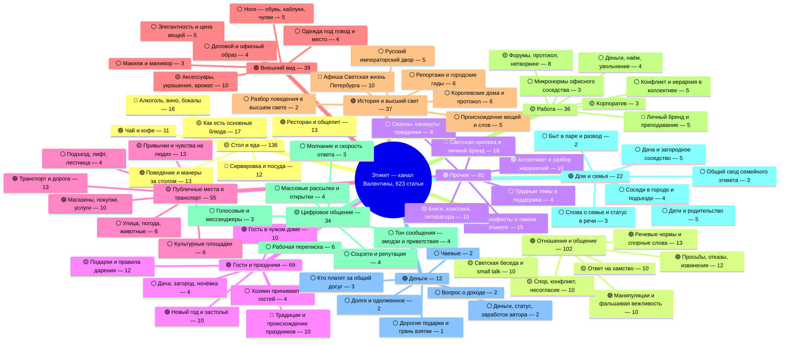

# Майндмап освещённых тем канала «Валентина Хлистун | Этикет»

**Дата:** 26 июля 2026
**Источник данных:** выгрузка Дзен-Студии по 623 статьям за 2023–2026 гг. + тематическая разметка (сцена, подтема, функция текста, порог входа) + полные тексты статей.
**Как читалось:** 11 независимых разборов — по одному на каждую сцену. Все цифры ниже взяты из выгрузки, ничего не додумано. Там, где в подтеме меньше 10 статей, вывод помечен как «мало данных»: цифры показывают направление, но ничего не доказывают.
**Статус документа:** рабочая карта. Служит основой для файла `2026-07-26-temy-kandidaty.md`.

**Три эпохи, на которые делятся все цифры:**

| Эпоха | Период | Что это |
|---|---|---|
| 1 — до спада | до июля 2025 | старый алгоритм Дзена, «польза» раздавалась |
| 2 — склон | август–октябрь 2025 | переход |
| 3 — дно | с ноября 2025 | новый алгоритм: раздаётся «разбор чужого поведения» и «разъяснение спорной нормы» |

**Условные знаки на карте:**
🟢 работает сейчас — 🟡 работала раньше, сейчас нет — 🔴 не работала никогда — ⚪ мало данных

---

## 1. Карта канала одним взглядом

На диаграмму вынесено по 6 подтем на сцену. Полные списки — ниже, в разборе каждой сцены.

---

## 2. Разбор по сценам

### 2.1. Стол и еда — 136 статей (21,8% канала)

Самая большая сцена канала и самая пострадавшая. 62 статьи до спада (медиана 541 563 показа / 17 112 дочитываний), 14 на склоне (35 671 / 745), 60 на дне (5 680 / 127) — падение медианы почти в 100 раз.

**Все подтемы:**

| Подтема | Статей | Статус | Ключевая цифра |
|---|---|---|---|
| Алкоголь, вино, тосты, бокалы | 18 | 🔴 | 13 из 18 на дне, медиана 6 792, ни одной выше 100 000 |
| Как есть основные блюда | 17 | 🟡 | было 1 760 121 → стало 2 107, падение в 835 раз |
| Ресторан и общепит | 13 | 🟢 | медиана дна 128 806 — лучшая в сцене |
| Поведение и манеры за столом | 13 | 🟢 | дала оба сверхвыброса дна |
| Сервировка и посуда | 12 | 🔴 | максимум за 3 года 442 985, хита не было ни разу |
| Как есть десерты, фрукты, яйца | 11 | 🟡 | 601 999 → 6 414 |
| Чай и кофе | 11 | 🟢 | медиана дна 176 552 — в 31 раз выше медианы сцены |
| Диковинные столовые приборы | 10 | 🟡 | вся подтема только в эпохе 1, медиана 291 753 |
| Правила обращения с приборами | 10 | 🟡 | медиана дна 2 353, но один прорыв 2 012 885 |
| Праздничный и домашний стол | 10 | 🔴 | медиана за 3 года 8 754, ни одного хита |
| Гастрокультура и история | 6 | ⚪ | разброс от 599 340 до 1 429 |
| Своды правил и смысл этикета | 5 | ⚪ | «Зачем нужен столовый этикет?» 1 171 149 |

**Что работает.** Дно неоднородно: 35 из 60 статей набрали меньше 10 000 показов, но 14 взяли больше 100 000, включая «Можно ли сидеть за столом скрестив ноги» (8 594 800 показов, 482 547 дочитываний, 1 067 комментариев) и «Почему нож справа, а вилка слева?» (2 012 885 / 95 473 / 529). Раздача не исчезла — исчезла раздача у справочной «пользы»: на дне медиана функции «польза» 3 950 показов (37 статей), а «разъяснение нормы» — 32 473 (13 статей), в 8 раз выше.

Живые ветки на дне: ресторан (медиана 128 806, комментарии 551 при общей медиане дна 0) и чай/кофе (176 552). Работает всё, где норма касается тела читателя или массовой бытовой еды: «Как есть мелкую хитрую еду» 1 157 655, «Как есть помидоры черри» 973 816, «Что делать с лимоном из чая?» 1 067 084.

**Что не работает.** Статусная и абстрактная еда: морепродукты 2 040, сырная тарелка 1 276, специи 1 351, овощи 2 107, мясные блюда 2 176. Товароведение алкоголя: «Аперитивы» 1 522, «Подача спиртных напитков» 1 990, «Как выбрать бокалы» 2 152. Схемы и инструкции: «Четыре зоны тарелки» 1 771, «Десертные приборы» 1 361, «Передавайте кружки правильно» 1 853.

Заголовок-вопрос сам по себе не спасает: «Можно ли чокаться стаканами с водой» — 1 639, «Нужны ли подставки под напитки?» — 1 751. Работает только тогда, когда спор идёт о привычке живого человека, а не о свойстве предмета.

**Повторы.** Три типа.
1. *Прямые дубли.* «Как есть яйца» — две статьи с идентичным заголовком: 6 показов и 26 069. Всего про яйца четыре статьи.
2. *Тема, переписанная через год.* Суп (4 376 348 и 2 205 470), мороженое (130 552 и 3 877 521), фрукты (3 185 904 и 318 622), чай (40 375 / 1 338 101 / 3 950), салфетка (1 725 918 и 1 212 911), ресторан (1 894 933 / 19 545 020 / 628 132).
3. *Дубли внутри двух месяцев — самое вредное.* «Что делать с лимоном из чая?» 9 марта 2026 — 1 067 084 показа, «Тонкости лимонного этикета» 10 марта — 2 257. Разница в 473 раза при одном предмете. Схема сервировки повторена трижды.

Отдельно — серийные повторы формата: восемь статей «прибор для одного продукта» и шесть статей «тонкости обращения с X» (овощи, специи, лимон, морепродукты, мясо, китайский этикет) — последние шесть суммарно набрали меньше 12 000 показов на всех.

---

### 2.2. Отношения и общение — 102 статьи (16,4% канала)

Главная опора канала. Медиана до спада 704 111 / 30 327 (59 статей), на склоне 651 067 / 23 987 (16), на дне 84 251 / 5 055 (27) — падение всего в 8,4 раза, вчетверо мягче, чем у стола.

**Все подтемы:**

| Подтема | Статей | Статус | Ключевая цифра |
|---|---|---|---|
| Речевые нормы и спорные слова | 13 | 🟢 | «Разница между есть и кушать» 15 431 678 |
| Просьбы, отказы, извинения | 12 | 🟢 | «Как вежливо отказать соседу на даче» 4 751 764 |
| Знакомство, приветствие, имена | 11 | 🟡 | дно 53 382 — ниже медианы дна |
| Ответ на хамство и обесценивание | 10 | 🟡 | до спада медиана 2 485 128 — лучшая в сцене |
| Спор, конфликт и несогласие | 10 | 🟡 | дно 19 350 — в 4,3 раза ниже медианы дна |
| Манипуляции и фальшивая вежливость | 10 | 🟢 | единственная, не просевшая на склоне |
| Светская беседа и small talk | 10 | 🟡 | дно 24 571 — худшая подтема сцены |
| Мужчина и женщина: ожидания | 7 | ⚪ | дно 508 681 — в 6 раз выше медианы дна |
| Раздражающее поведение собеседника | 7 | ⚪ | «Привычка перебивать» 3 138 888 |
| Невербалика и чтение человека | 6 | ⚪ | медиана 1 743 122 — высшая в сцене, но брошена |
| Обидные фразы и комплименты | 6 | ⚪ | «5 обидных фраз» 2 024 144 на дне |

**Что работает.** Три лучших результата всей эпохи дна стоят именно здесь: «Как вежливо отказать соседу на даче» (4 751 764 / 349 832 / 2 222 комментария), «Привычка перебивать собеседника» (3 138 888 / 109 439 / 867), «5 обидных для собеседника фраз» (2 024 144 / 87 882 / 510).

Раскол по функции на дне абсолютный: разбор чужого поведения + разъяснение нормы (9 статей) дают медиану 189 073 показа и 234 комментария, «польза» (17 статей) — 76 281 и 61. Ещё резче делит формулировка: 10 статей дна с оценочной подачей дают медиану 645 731 против 53 943 у 17 нейтрально-справочных — разрыв в 12 раз.

Гендерные нормы — всего 7 статей, но на дне медиана 508 681, в 6 раз выше фона; «Кто такие тарелочницы» дала рекордный CTR сцены 0,2669 и 1 010 комментариев всего при 189 073 показах.

**Что не работает.** Форма «Как ...» выдохлась: 9 таких статей на дне дают медиану 84 251 против 132 677 у остальных 18. Светская беседа — самый глубокий провал: 6 статей дна дают 24 571, «5 ice breakers для светского вечера» — 4 424 показа и 120 дочитываний, худший результат сцены (узкий порог + англицизм в заголовке). Узкий порог вообще убивает: 2 статьи дна с узким порогом дают 17 524 против 147 926 у бытовых.

**Брошенный актив.** Невербалика — сильнейшая подтема по медиане (1 743 122 показа; «Как читать человека за секунды» 17 325 586, «Как оскорбить человека не сказав ни слова» 7 553 981), но с 8 октября 2025 в ней не вышло ни одной новой статьи.

**Повторы.** Их очень много, и почти всегда каждый следующий заход слабее.
- Точный дубль заголовка: «Как сообщить плохие новости» — 983 500 и 147 926 (в 6,6 раза меньше).
- Реакция на грубость — четыре статьи: 761 072 / 14 250 473 / 3 645 582 / 2 485 128. Последние две различаются только словом «грубость» и «оскорбления».
- Списки «фразы, которые...» — пять статей, три подряд за месяц: 1 105 942 → 570 419 → 95 022 → 106 416 → 2 024 144. Падение в середине ряда — явное самоканнибалирование.
- Спор и несогласие — пять статей плюс «Принципы этикета в конфликтных ситуациях» (19 350) как общий пересказ всей пятёрки, худший результат подтемы.
- Small talk — пять статей, последние две с разницей в 5 дней (4 424 и 30 625).
- Лицемерная вежливость — пять статей, две из них с разницей в 5 дней.
- Имена — три статьи, две из них через 19 дней друг за другом.
- Первое впечатление — четыре статьи, две с разницей в 12 дней.

---

### 2.3. Прочее — 81 статья (13,0% канала)

Самая контрастная сцена: от 209 показов до 10 139 251. Медиана по эпохам почти не двигается (до спада 36 501, склон 67 575, дно 45 310), потому что внутри уживаются две несовместимые редакции. Главный сдвиг виден в комментариях: медиана выросла с 7 до 98 — в 14 раз. Аудитория перестала потреблять и начала спорить.

**Все подтемы:**

| Подтема | Статей | Статус | Ключевая цифра |
|---|---|---|---|
| Светская хроника и личный бренд | 18 | 🔴 | медиана 10 209 / 132; ни одной выше 67 тыс. за 3 года |
| Манифесты о самом этикете | 15 | 🟢 | «Тихая роскошь поведения» 10 139 251 |
| Антиэтикет и разбор нарушений | 10 | 🟢 | медиана дна 619 640 — в 13,7 раза выше сцены |
| Книги, классика, литература | 10 | 🟡 | 196 044 → 38 153, падение в 5,1 раза |
| Сезоны, каникулы, праздники | 8 | ⚪ | «Этикет в жару» 1 791 486 |
| Диалог с подписчиками и курьёзы | 6 | ⚪ | медиана 19 607 |
| Школа, дети, воспитание | 5 | ⚪ | «Этикет для школьников» 1 132 749 против «Оценки за поведение» 8 006 |
| Страны, города, чужие культуры | 5 | ⚪ | медиана 14 189, но комментарии не падают |
| Трудные темы и поддержка | 4 | ⚪ | «Траурный этикет» 3 916 793 / 242 185 / 1 041 |

**Что работает.** Единственная подтема, пережившая слом алгоритма без потерь, — «Антиэтикет и разбор нарушений»: медиана на дне 619 640 показов и 27 536 дочитываний против 45 310 / 875 по сцене. Два самых свежих примера почти дублируют друг друга по смыслу и оба выстрелили: «Какие правила этикета постоянно нарушают?» (963 865 / 50 407 / 693 комментария) и «Топ-5 антиэтикетных повседневных действий» (1 164 110 / 74 693 / 723). Тема не выгорает — её можно повторять.

Манифесты держатся: дно 80 279 / 7 032, а без сорванного перезалива — 544 719 / 11 756. Формат «свод правил» выжил: «100 правил этикета» в феврале 2026 дал 1 379 665 показов, «Этикет 2026: 10 новых трендов» — лучший CTR на дне 0,1921.

**Что не работает.** Настоящий балласт — «Светская хроника и личный бренд»: 18 статей, 22% сцены, медиана 10 209 показов и 132 дочитывания. «Лекция в РГГУ» — CTR 0,0071 при 55 431 показе и 158 дочитываниях, «ЗимФестАмур» — CTR 0,0091 при 53 628 показах и 88 дочитываниях. Это провал не алгоритма, а формата: обе цифры из эпохи до спада тоже мертвы.

Обвалилась справочно-культурная линия: подборки книг («8 книг по этикету» — 624 285 показов при дочитываемости 1,1%; повтор через 4 месяца — 101 353).

**Недоиспользованное.** «Траурный этикет» дал 3 916 793 показа, 242 185 дочитываний и 1 041 комментарий — и за два с половиной года к теме не вернулись ни разу; вся подтема состоит из четырёх статей.

**Повторы.** Технический дубль: «Когда-нибудь она станет президентом» опубликована дважды (209 и 13 478 показов). Прямые смысловые: две подборки книг, «Этикет на каникулах» и «Этикет против каникул», «Нормально ли не любить классику» и «...театр». Мероприятийные — самые плотные: проект «Образ будущего» описан четырежды (8 239 / 8 878 / 12 248 / 6 331), одна поездка в Пекин дважды, одна лекция в двух вузах, бренд Levrana дважды.

**Вывод по повторам этой сцены:** дублирование мероприятий и справочных подборок только делит показы, а дублирование спорной нормы («нарушения», «каникулы») наоборот наращивает.

---

### 2.4. Гости и праздники — 69 статей (11,1% канала)

Сцена раскололась надвое, и раскол проходит не по эпохам, а по типу сюжета. Всё, что про физический визит в чужой дом (18 статей), на дне держит медиану 247 687 показов и 31 790 дочитываний, а всё календарно-подарочное (51 статья) — 12 008 и 551. Разрыв в 20 раз внутри одной сцены. До спада тот же разрыв был четырёхкратным (1 279 095 против 321 478) — то есть алгоритм не убил сцену, а выбрал внутри неё одну половину.

**Все подтемы:**

| Подтема | Статей | Статус | Ключевая цифра |
|---|---|---|---|
| Календарные даты и подарки к ним | 13 | 🟡 | 326 006 → 14 550, падение в 22 раза |
| Подарки: правила дарения | 12 | 🟡 | дно 3 461 — падение в 121 раз |
| Гость в чужом доме | 10 | 🟢 | дно 106 508 при CTR 15,22% |
| Новый год и новогоднее застолье | 10 | 🟢 | «Три ошибки на новогоднем вечере» 3 763 967 |
| Традиции и происхождение праздников | 10 | 🔴 | дочитываемость около 1%, медиана 55 379 / 573 |
| Цветы как подарок | 6 | ⚪ | «Цветы в горшках дарить нельзя» 2 914 837 |
| Хозяин: приём гостей дома | 4 | ⚪ | медиана дна 3 351 102 — топ-4 сцены |
| Дача, загород, ночёвка | 4 | ⚪ | медиана 1 909 428 — самая высокая в сцене |

**Что работает.** Четыре из пяти сильнейших статей эпохи дна — «дом и визит»: «Можно ли мыть посуду при гостях» 3 837 562 / 195 100, «Этикет в гостях с ночевкой на даче» 3 534 182 / 215 121, «Как принимать гостей в квартире» 2 864 643 / 164 775, «Три ошибки на новогоднем вечере» 3 763 967 / 107 585.

Дача — самый мощный и самый недоразработанный узел: всего 4 статьи, три из четырёх миллионники, «Этикет на даче у друзей» собрало 4 897 312 показов, 512 442 дочитывания и 2 415 комментариев.

Разбор чужого поведения даёт запредельную конверсию при скромной раздаче: «Наглость или забота гостей?» — CTR 28,34%, «Самый раздражающий гость, это вы?» — 25,02%. Заголовкам не хватает конкретной бытовой сцены в первых трёх словах, поэтому алгоритм не отдаёт им миллионы.

**Что не работает.** Формат «можно ли» сам по себе ничего не гарантирует: «Можно ли мыть посуду при гостях» — 3,8 млн, а «Сухие цветы: можно ли дарить по этикету» — 3 284 и «Телефоны за новогодним столом: допустимо или моветон» — 2 570. Разница в том, что в первом случае спорится действие живого человека при свидетелях, во втором — свойство предмета.

Предметные ветки умерли целиком: подарки на дне 3 461 (было 419 355), цветы 2 100 (было 1 056 027), алкоголь 4 667 и 2 256. Календарь перестал кормить: 8 марта 524 257 → 14 550 (в 36 раз), 9 мая 326 006 → 13 526, День народного единства 8 075. Познавательные статьи про традиции не работали никогда: за три года медиана 55 379 показов и 573 дочитывания, «Вербное воскресенье» — 169 399 показов и 1 366 дочитываний (около 1%).

Декабрь 2025 показал, что дело не в сезоне, а в формате: из 8 новогодних статей три взяли 3,76 млн, 1,21 млн и 960 тыс., а пять не добрали и 40 тыс. — провалились сборники («Новый год: тосты, подарки, сервировка» 890 / 6) и «мягкие» утешительные тексты.

**Повторы.** Тройной повтор 8 марта (306 720 / 524 257 / 14 550). Годовые переиздания календарных дат — во всех трёх парах второй заход слабее в 3–24 раза. «Цветы мужчинам» дважды: 12 623 и 1 056 027 — разница в 84 раза. Китайский Новый год дважды, оба слабые. Алкоголь в подарок дважды с интервалом ровно в месяц, обе провалились. 1 сентября — две статьи с интервалом в два дня, вторая каннибализировала первую. Роль гостя пересказана трижды.

**Единственный продуктивный повтор сцены:** «Этикет на даче у друзей» и «Этикет в гостях с ночевкой на даче» — обе миллионники, потому что вторая добавила новое обстоятельство (ночёвку), а не пересказала первую.

---

### 2.5. Публичные места и транспорт — 55 записей (8,8% канала)

Фактически 54 статьи: «Этикет под зонтом» от 16.10.2023 продублирован пустой строкой с 0 показов. Медиана: 376 094 до спада (36 статей), 144 241 на склоне (6), 45 430 на дне (12) — падение в 8,3 раза. Медиана CTR при этом не падала, а росла: 0,0514 → 0,0502 → 0,0861. Заголовки стали кликать заметно лучше, а раздачи нет — проблема не в упаковке, а в функции текста.

**Все подтемы:**

| Подтема | Статей | Статус | Ключевая цифра |
|---|---|---|---|
| Транспорт и дорога | 13 | 🟢 | дно 48 672 / 2 534 — выше медианы сцены |
| Привычки и чувства на людях | 13 | 🟡 | падение в 47 раз при росте CTR |
| Магазины, покупки, услуги | 10 | 🟢 | падение всего в 2,2 раза; дно 142 075 |
| Культурные площадки | 6 | ⚪ | театр 1 714 152, библиотека 8 930 |
| Улица, погода, животные | 6 | ⚪ | собака на дне 80 515 / 5 313 / 204 комментария |
| Подъезд, лифт, лестница | 4 | ⚪ | медиана до спада 2 015 944 — рекорд сцены |
| Память и чужие культуры | 3 | ⚪ | худшее соотношение показов и дочитываний |

**Что работает.** Единственная растущая ветка — магазины: «Этикет в продуктовом магазине» на дне дал 590 625 / 14 418 и 524 комментария (13 медиан дна), «Этикет в магазине одежды» — 142 075 / 7 428. Транспорт держится на уровне канала и даёт лучшую вовлечённость: автобус 182 комментария, метро 148.

Пять топов сцены — «Хлопайте в конце полета» 7 236 400, «подъем по лестнице» 5 970 893, «Кофе с собой – моветон?» 4 016 806 при 6 844 комментариях, «домофон» 2 015 944, «театр» 1 714 152 — все держатся на спорной норме или гендерном конфликте, даже когда формально помечены как «польза». Механика нового алгоритма работала у Валентины и раньше, просто не была названа.

**Что не работает.** Сцена почти не перестроилась: из 12 статей на дне 10 всё ещё «польза». Мёртвая зона — справочные тексты без конфликта: библиотека 8 930 / 144, фотостудия 14 844 / 225, вандализм на памятниках 10 128 / 119, «Путешествие без границ» — 158 785 показов при 171 дочитывании (0,1%).

Хуже всего просела ветка личных привычек и чувств — падение в 47 раз, при том что именно там сосредоточены рекорды прошлого. Статьи с прямым вопросом дают экстремальную вовлечённость при малом охвате: «Как элегантно раздеться в городе» — 110 комментариев на 513 дочитываний (21,4%), «Можно ли плакать на публике?» — 88 на 823 (10,7%). Формат найден, масштаба темы не хватает.

**Брошенный актив.** Подъезд, лифт, лестница, домофон — медиана до спада 2 015 944, последняя публикация 06.09.2025. Крупнейший неиспользуемый резерв сцены.

**Повторы.** Минимум 12 пар и троек. Зонт — 3 захода, театр — 2 (ремейк −24%), метро — 3 (каждый следующий слабее по показам, но растёт CTR: 0,0264 → 0,134 → 0,0761), магазин одежды — 3 плюс примыкающая про тестеры, самолёт и наушники — 4 текста об одном конфликте «чужой звук», «Этикет автомобилиста» и «Этикет в пробке» с разницей в 19 дней.

**Вывод по повторам:** ремейк почти всегда слабее оригинала (театр −24%, метро −90%, самолёт −99%). Исключения — только там, где сменилась функция текста или тема стала бытовее: продуктовый +831%, музей +99%, зонт +480%.

---

### 2.6. Внешний вид — 39 статей (6,3% канала)

Сцена просела меньше всех: медиана показов упала с 279 462 (23 статьи эпохи 1) до 216 739 (10 статей эпохи 3) — минус 22%; дочитывания с 10 025 до 8 071 — минус 19%.

**Все подтемы:**

| Подтема | Статей | Статус | Ключевая цифра |
|---|---|---|---|
| Аксессуары, украшения, аромат | 10 | 🟡 | медиана 743 196 / 29 224; ни одной статьи с ноября 2025 |
| Ноги: обувь, каблуки, чулки | 5 | ⚪ | единственная ветка, где каждая эпоха сильнее предыдущей |
| Элегантность и цена вещей | 5 | ⚪ | три статьи за 6 недель весной 2026 |
| Деловой и офисный образ | 4 | ⚪ | 219 296 (2023) → 43 239 (2024) → 23 274 (2026) |
| Одежда под повод и место | 4 | ⚪ | разброс на дне от 968 до 491 044 |
| Макияж и маникюр | 3 | ⚪ | брошено с августа 2024 |
| Тело: осанка, посадка, оголённость | 3 | ⚪ | «Лето раздевает» — 1 251 комментарий |
| Мужской образ | 3 | ⚪ | свежая статья в 8 раз выше старых |
| Мода, бренды, история вещей | 2 | ⚪ | единственная ветка без нормы |

**Что работает.** Держится не «сцена целиком», а один формат. На дне две статьи-разъяснения спорной нормы дали 5 716 823 («Этикет против колготок») и 491 044 («Нужен ли дресс-код в спортзалах»), тогда как медиана семи статей-«пользы» той же эпохи — 61 319 показов и 3 528 дочитываний. По всей сцене «разъяснение нормы» (13 статей) даёт медиану 491 044 / 11 250, «польза» (18 статей) — 178 714 / 6 783.

Все четыре рекорда сцены — конфронтационный заголовок про один конкретный предмет: колготки 5 716 823, часы 4 043 613, украшения 2 547 882, каблуки 1 802 519. Формулы: «Этикет против X», «Как X нарушают этикет», «Почему вы носите X не на той руке». Предмет должен быть женским, ежедневным и почти обязательным — тогда приходят комментарии: колготки 1 648, оголённость 1 251, украшения 917, часы 830, каблуки 650.

**Что не работает.** Обобщения проседают тем сильнее, чем абстрактнее: три статьи про элегантность за шесть недель весной 2026 дали 61 319, 363 461 и 15 807; «Что надеть на работу?» — 23 274 при 899 дочитываниях. Показателен контраст внутри одной подтемы: календарный совет «Шпильки дома и пижамы на праздник» — 968 показов и 10 дочитываний (худший результат сцены), а вопрос-спор про спортзал — 491 044 и 320 комментариев.

**Брошенные активы.** Аксессуары и украшения — самая доходная подтема (медиана 743 196 / 29 224), ни одной статьи с ноября 2025. Макияж и маникюр — три статьи, все до августа 2024, при том что «Маникюр по этикету» собрал 760 917 показов. Мужская тема почти не занята (3 статьи), но единственная свежая — «Топ-5 ошибок мужского образа» — дала на дне 317 415 против 34–43 тысяч у старых мужских текстов.

**Повторы.** Часы дважды (4 043 613 и 329 144). Очки дважды. Колготки дважды (97 385 и 5 716 823 — разница в подаче даёт разницу в 59 раз). Элегантность — четыре пересекающихся текста, три из них за шесть недель. Деловой дресс-код — одна справочная статья, переписанная трижды, каждый раз слабее. Удачный повтор один: броши (1 017 475) и «Как украшения нарушают этикет» (2 547 882) — вторая переписана из «как правильно» в «как нарушают».

---

### 2.7. История и высший свет — 37 статей (5,9% канала)

Формально единственная выросшая сцена: медиана показов поднялась с 49 971 (18 статей эпохи 1) до 67 592 (18 статей эпохи 3). Но медиана дочитываний за то же время упала с 942 до 271 — в 3,5 раза.

**Все подтемы:**

| Подтема | Статей | Статус | Ключевая цифра |
|---|---|---|---|
| Афиша «Светская жизнь Петербурга» | 10 | 🔴 | дочитываемость 0,19% — худшая в канале |
| Королевские дома и протокол | 6 | ⚪ | медиана 251 490 / 18 747; ни одной статьи с декабря 2024 |
| Репортажи с событий и городские гиды | 6 | ⚪ | без одного выброса медиана 8 852 / 84 |
| Русский императорский двор | 5 | ⚪ | эпоха 3 медиана 205 524 / 8 266 |
| Происхождение вещей, слов, тайных знаков | 5 | ⚪ | кольца для салфеток 3 942 372 |
| История этикета как института | 3 | ⚪ | общий обзор 1,2–1,6% дочитываемости |
| Разбор чужого поведения в высшем свете | 2 | ⚪ | CTR 0,1938 и 0,1933 — рекорд сцены |

**Что работает.** Если убрать афишу, картина переворачивается: оставшиеся 8 статей эпохи 3 дают медиану 205 524 показа и 8 266 дочитываний против 49 971 и 942 в эпохе 1 — рост в 4,1 раза по показам и в 8,8 раза по дочитываниям.

Лучшая механика подтверждена дважды: обе статьи с функцией «разбор чужого поведения» дали CTR 0,1938 и 0,1933 и дочитываемость 10,7% и 11,4%; одна вышла на склоне, другая на дне — формат не просел вместе с алгоритмом.

Второй рабочий механизм — парадоксальный переворот привычного предмета: «Как предмет бедности стал признаком роскоши» (3 942 372 / 169 404 / 693 комментария) и «Фамилии, которые стали словами» (2 047 682 / 81 725 / 513).

**Что не работает.** Афиша: 10 выпусков с 18.05.2026 по 20.07.2026, медиана 62 017 показов и 120 дочитываний, CTR деградирует внутри рубрики с 0,0313 до 0,0077. Это 56% всего производства сцены за период, и именно она раздувает медиану показов, не давая ни дочитываний, ни обсуждения.

Провалы одинаковы во всех эпохах и имеют один признак — описание без нормы и без нарушителя: «Балы в Российской империи» 20 171 / 365, «Этикет веера» 34 031 / 434, «Язык цветов» 12 824 / 272, любой отчёт о конкретном событии 2 231–15 237 показов.

**Брошенный актив.** Королевская ветка: медиана 251 490 показов и 18 747 дочитываний, но ни одной новой статьи с декабря 2024 года, кроме единственного протокольного разбора в октябре 2025.

**Повторы.** Крупнейший кластер — сама афиша: 10 выпусков, шесть из них начинаются буквально одной формулой, вместе дают 1 573 дочитывания на 697 067 показов. Новый год — три материала об одном придворном ритуале. Пётр I — два полностью пересекающихся. «Как родился этикет» и «История этикета в России» — шесть недель разницы, один предмет. Отчёты о выставках — один жанр трижды с одинаково низким результатом.

---

### 2.8. Работа — 36 статей (5,8% канала)

Одна из самых мощных по потолку: шесть статей из 36 перевалили за миллион показов. Медиана по эпохам: 287 605 (28 статей), 461 444 (3), 16 346 (5); по дочитываниям — 8 900 → 15 865 → 424, то есть падение дочитываний в 21 раз.

**Все подтемы:**

| Подтема | Статей | Статус | Ключевая цифра |
|---|---|---|---|
| Форумы, протокол, нетворкинг | 8 | 🟡 | медиана 122 714 показов при 1 203 дочитываниях |
| Конфликт и иерархия в коллективе | 5 | ⚪ | медиана 1 089 451 / 45 303 — лучшая в сцене |
| Личный бренд и преподавание | 5 | 🔴 | медиана 18 268 / 178; худший CTR сцены 1,27% |
| Деньги, наём и увольнение | 4 | ⚪ | дно 12 273 |
| Стресс, волнение, выступления | 4 | 🟡 | все в эпохе 1, разброс в 142 раза |
| Микронормы офисного соседства | 3 | ⚪ | «Как привет может стоить карьеры» 5 790 566 |
| Корпоратив | 3 | 🟡 | 875 035 → 295 305 → 16 346 за три декабря |
| Деловые и корпоративные подарки | 2 | ⚪ | тема не поднималась с августа 2024 |
| Этикет в сфере обслуживания | 2 | ⚪ | клиент 415 875 против исполнителя 15 565 |

**Что работает.** Разрыв по функциям внутри сцены огромный: медиана показов у «разъяснения нормы» (5 статей) — 1 304 871, у «пользы» (23 статьи) — 295 305, у «познавательного» (7 статей) — 19 414. Единственный «разбор чужого поведения» — «Служебный роман» — дал 1 421 403 и больше не повторялся ни разу.

Самые обсуждаемые статьи: «привет» (1 107 комментариев), «крики начальства» (864), «ниже по рангу» (804), «фоллоу-ап» (741), «Служебный роман» (684), «запах коллеги» (665). Все шесть либо разбирают чужое поведение, либо разъясняют спорную норму.

**Что не работает.** Обвал на дне объясняется не темой, а функцией: среди пяти статей эпохи «дно» нет ни одного «разъяснения нормы» и ни одного «разбора чужого поведения» — четыре «пользы» и одна «познавательная».

Порог входа работает жёстко: в эпохе 1 бытовые темы дали медиану 404 458 показов против 99 740 у узких. Вся ПМЭФ-серия из пяти статей июня 2025 — медиана 140 440 показов и всего 1 067 дочитываний.

Пять автобиографических материалов о лекциях, съёмках и наставничестве (медиана 18 268 показов и 178 дочитываний) не работали никогда — ни до спада, ни после.

Заголовки при этом не сломались: «Как не выглядеть смешно на корпоративе» на дне дала CTR 11,7% при 16 346 показах — кликают по-прежнему, а раздачи нет, потому что тело статьи остаётся инструкцией.

**Сцена заброшена.** Последняя статья вышла 2 марта 2026 года, почти пять месяцев назад; за весь 2026 год их всего четыре.

**Повторы.** Корпоратив — три почти идентичные статьи три декабря подряд, падение в 54 раза. Повышение зарплаты — дубль с падением в 14 раз. ПМЭФ-серия содержит два внутренних дубля, один из них — две статьи, выпущенные два дня подряд об одном и том же. Публичные выступления — фактически один материал в двух подачах. Личный бренд — три отчёта об авторских лекциях с одинаковым результатом 12–19 тысяч.

---

### 2.9. Цифровое общение — 34 статьи (5,5% канала)

22 статьи до спада, 2 на склоне, 10 на дне. Медиана показов упала с 217 937 до 43 834 (в 5 раз), но дочитывания рухнули сильнее — с 7 727 до 559, то есть в 13,8 раза. Алгоритм не просто урезал раздачу, он перестал доводить читателя до конца текста.

**Все подтемы:**

| Подтема | Статей | Статус | Ключевая цифра |
|---|---|---|---|
| Рабочая переписка: чаты, почта, аватар | 6 | ⚪ | медиана до спада 52 138 / 748 — вчетверо ниже фона |
| Массовые рассылки и открытки | 4 | ⚪ | медиана 458 263 / 11 599; брошена после июля 2025 |
| Тон сообщения: эмодзи, реакции, приветствия | 4 | ⚪ | единственная, где свежая статья не хуже старых |
| Соцсети: репутация, подписки, комментарии | 4 | ⚪ | «Токсичные комментарии» 1 497 192 / 872 комментария |
| Молчание, «в сети» и скорость ответа | 3 | ⚪ | медиана 1 046 821 / 42 007 — сильнейшая подтема |
| Голосовые сообщения и мессенджеры | 3 | ⚪ | слабые показы, высокая доходимость и комментарии |
| Телефон вместо людей и перегрузка | 3 | ⚪ | 544 316 показов при 1 968 дочитываниях |
| Отдельные площадки: знакомства, игры, школа | 3 | ⚪ | разброс показов в 40 раз |
| Телефонные звонки и отказы | 2 | ⚪ | медиана 736 185 / 30 283 |
| Искусственный интеллект и этикет | 2 | ⚪ | провалился дважды: 35 014 и 14 780 |

**Что работает.** Сцена жива: «Почему не стоит писать „Доброго времени суток“?» (апрель 2026) — 1 347 421 показ, 28 007 дочитываний, 992 комментария (31 медиана дна по показам и 50 по дочитываниям); «Этикет на сайте знакомств» (январь 2026) — 853 642 / 15 606 / 310. Обе выжившие статьи держатся на споре о конкретной формулировке или конкретной площадке, а не на общем «как правильно вести переписку».

Функция «разъяснение нормы» встречается всего 6 раз из 34, и на дне её медиана показов 697 655 против 30 496 у «пользы» — разрыв в 23 раза, при том что вся сцена построена на «пользе» (22 статьи из 34).

**Что не работает.** Патология дна — большая раздача при нулевой доходимости: «Цифровая этика в школе» 157 543 показа при CTR 0,0068 и 229 дочитываниях (0,15%), «Информационный этикет» 544 316 показов при 1 968 дочитываниях (0,36%). Алгоритм показал, читатель не открыл.

Всё с узким порогом провалилось независимо от эпохи: «Завоевание видео-эфира» 6 474, «Как получить 50 тысяч подписчиков за год» 20 064, «Этикет для геймеров» 21 214. Тема ИИ — единственная подтема с двумя провалами в разных эпохах.

Голосовые — обратный случай: три статьи на дне дали слабые показы (39 778, 47 890, 7 812), но у «Сорри за войс» доходимость 5,6% и 120 комментариев. Тема живая, заголовок не вытягивает раздачу.

**Брошенные активы.** «Молчание и скорость ответа» (медиана 1 046 821 / 42 007) и «Массовые рассылки» (458 263 / 11 599) — обе полностью заброшены после июля 2025, хотя обе устроены как разбор чужого поведения.

**Повторы.** Групповые чаты — прямой дубль с почти идентичными цифрами. Массовые открытки — дубль с четырёхкратным разрывом в пользу второго захода («Как реагировать на массовые открытки» 1 163 779 / 68 212 / 854 против «Электронные открытки» 602 965 / 14 352 / 113): второй заголовок обещает реакцию, а не описание. Голосовые — три статьи за пять месяцев, две последние с разницей в 12 дней. Молчание и неответ — три угла одного сюжета за полгода. Три статьи с почти одинаковым названием «Цифровой этикет» конкурируют друг с другом.

---

### 2.10. Дом и семья — 22 статьи (3,5% канала)

4 статьи в эпохе 1, 3 на склоне, 15 на дне — Валентина уже развернулась сюда после августа 2025, но покрытие тонкое: примерно одна статья в две недели. Медиана дна: 157 694 показа и 5 339 дочитываний, медиана CTR на дне 0,1052 против 0,0246–0,0439 в 2024 году.

**Все подтемы:**

| Подтема | Статей | Статус | Ключевая цифра |
|---|---|---|---|
| Дача и загородное соседство | 5 | ⚪ | двугорбая: два хита и три провала за 8 недель |
| Дети и родительство | 5 | ⚪ | потолок за всю историю 271 756, ни одной спорной нормы |
| Соседи в городе и подъезде | 4 | ⚪ | медиана дна 970 923 — в 6 раз выше фона |
| Слова о семье и статус в речи | 3 | ⚪ | две статьи дают 85% показов всей сцены |
| Общий свод семейного этикета | 3 | ⚪ | 1 949 015 → 168 902 → 52 773 |
| Быт в паре и развод | 2 | ⚪ | медиана 1 722 064 / 82 891 |

**Что работает.** Две статьи одной жилы — «Когда муж перестает быть супругом» (48 166 619 показов, 1 072 551 дочитывание, 4 914 комментариев) и «Когда супруга перестает быть женой» (11 252 536 / 626 654 / 1 904) — дают 85% показов и 80% дочитываний всей сцены.

На дне разрыв по функциям виден в чистом виде: «разъяснение нормы» (4 статьи) — медиана 1 294 351 показ, «разбор чужого поведения» (2) — 507 190, «польза» (8) — 81 100. Спорная норма обгоняет пользу в 16 раз на одном и том же материале.

Соседская ветка на дне — медиана 970 923, и внутри неё та же развилка: «Можно ли не дружить с соседями» 1 617 779 против «Как выключить музыку у соседей» 32 231. Разница в 50 раз между вопросом и инструкцией.

**Что не работает.** Общий свод «Семейный этикет» умирает при каждом переиздании: 1 949 015 (июнь 2024) → 168 902 (окт 2025) → 52 773 (май 2026), падение в 37 раз при неизменной теме. Переписывать его в четвёртый раз бессмысленно.

Дачная ветка двугорбая: 998 951 и 585 679 показов у статей с конфликтом двух сторон и прямым запретом против 14 636, 15 430 и 22 724 у абстрактных «войны за границы», «этикет умер?» и «дачного этикета детей». Все пять вышли за 8 недель — сезон один, разница только в заголовке.

Самая слабая ветка — дети и родительство: пять статей, медиана 140 713 показов, потолок за всю историю 271 756, ни одной спорной нормы, всё подано как польза для родителей.

**Не тронуто вообще:** свекрови и тёщи, взрослые дети и пожилые родители, деньги в семье, бабушки и внуки, домашние животные — при том что это ровно повестка женщин 45+.

**Оговорка по данным.** Все шесть подтем содержат меньше 10 статей — статус везде «мало данных». Отдельно: статью «В семье не без урода» в расчётах использовать нельзя, у неё битые данные (дочитываний 12 044 при 10 984 показах, CTR 1,4141).

**Повторы.** Удачный: зеркальная пара муж/жена — оба выстрелили, но второй заход дал в 4 раза меньше, поэтому третий повтор конструкции нужно строить на другом объекте. Затухающий: три подхода к общему своду, каждый в 10 раз слабее. Дачный перегрев: пять статей за 8 недель, две из них практически об одном.

---

### 2.11. Деньги — 12 статей (1,9% канала)

Самая маленькая и самая доходная сцена. Медиана по ней — 809 781 показ и 36 235 дочитываний: уровень, которого остальные темы канала не дают даже на пике. По эпохам: до спада 1 238 790 / 42 054 (7 статей), склон 741 210 / 35 167 (1), дно 449 179 / 13 911 (4).

**Все подтемы:**

| Подтема | Статей | Статус | Ключевая цифра |
|---|---|---|---|
| Кто платит за общий досуг | 3 | ⚪ | ни разу не ниже 878 352 показов ни в одну эпоху |
| Чаевые | 2 | ⚪ | 1 256 и 987 комментариев — рекорд канала |
| Вопрос о чужом и своём доходе | 2 | ⚪ | медиана 1 875 357 / 75 517 — сильнейшая подтема |
| Долги и одолженное | 2 | ⚪ | 741 210 против 20 006 |
| Деньги, статус и заработок автора | 2 | ⚪ | медиана 34 686 — в 23 раза ниже сцены |
| Дорогие подарки и грань взятки | 1 | ⚪ | 17 139 показов |

**Что работает.** Конструкция «Кто платит за X?» пережила смену алгоритма без потерь: «Кто оплачивает пикник?» вышла 23.06.2026 — в худший период канала — и собрала 1 375 976 показов, 46 005 дочитываний и 740 комментариев, то есть выше медианы эпохи «до спада». Серия ни разу не опускалась ниже 878 352 показов.

Деньги — рекордсмен канала по вовлечённости: 1 256 комментариев у «Чаевые – всем!», 987 у «Оставить чаевые», 788 у «Сколько я зарабатываю», 740 у пикника, 550 у ресторана.

**Что не работает.** Все три провала сцены — статьи без спорной нормы о чужих деньгах: «Зависит ли элегантность от денег?» (54 273), «Подарки – это коррупция» (17 139), «Заработала свой первый миллион» (15 098). Ни одна не дотянула до 60 тысяч, причём две провалились ещё в эпоху 1, задолго до смены алгоритма.

Отдельная аномалия — «Дачные долги или шуруповерт „до завтра“»: CTR 22,28% и дочитываемость 13,6% от показов (лучшие цифры сцены) при всего 20 006 показах. Заголовок и обложка отработали идеально, а тему одолженных вещей алгоритм не стал раздавать — её нужно переписать в денежной рамке.

**Повторов вредных нет.** «Сколько я зарабатываю» и «Сколько ты зарабатываешь?» — фактически одна статья с интервалом в 4 месяца, обе выстрелили. Серия «кто платит» — рабочий шаблон, но такси (878 352) оказалось слабее пикника (1 375 976) при интервале всего в три месяца: следующую сцену серии стоит ставить не раньше чем через квартал.

---

## 3. Сводная таблица

| Сцена | Статей | Доля канала | Медиана показов до спада | Медиана показов на дне | Статус |
|---|---:|---:|---:|---:|:---:|
| Стол и еда | 136 | 21,8% | 541 563 | 5 680 | 🟡 |
| Отношения и общение | 102 | 16,4% | 704 111 | 84 251 | 🟢 |
| Прочее | 81 | 13,0% | 36 501 | 45 310 | 🟢 |
| Гости и праздники | 69 | 11,1% | 342 034 | 47 356 | 🟢 |
| Публичные места и транспорт | 55 | 8,8% | 376 094 | 45 430 | 🟡 |
| Внешний вид | 39 | 6,3% | 279 462 | 216 739 | 🟢 |
| История и высший свет | 37 | 5,9% | 49 971 | 67 592 | 🟢 |
| Работа | 36 | 5,8% | 287 605 | 16 346 | 🟡 |
| Цифровое общение | 34 | 5,5% | 217 937 | 43 834 | 🟡 |
| Дом и семья | 22 | 3,5% | мало данных, 4 статьи | 157 694 | 🟢 |
| Деньги | 12 | 1,9% | 1 238 790 | 449 179 | 🟢 |
| **Итого** | **623** | **100%** | — | — | — |

Пояснения к таблице:
- **Прочее** держится за счёт одной ветки («Антиэтикет», медиана дна 619 640) и одновременно тащит 18 статей балласта; статус 🟢 относится к живой половине.
- **Гости и праздники** — статус 🟢 относится к половине «дом и визит» (медиана дна 247 687); календарно-подарочная половина 🔴 (12 008).
- **История и высший свет** — 67 592 на дне получены с учётом афиши; без неё оставшиеся 8 статей дают 205 524.
- **Дом и семья** — 4 статьи в эпохе 1, медиана по такой выборке не считается.

---

## 4. Перекос: куда ушли силы и где они не окупились

### 4.1. Много статей — мало отдачи

| Что | Статей | Отдача | Комментарий |
|---|---:|---|---|
| Светская хроника, личный бренд, отчёты о мероприятиях (сцены «прочее» + «работа») | 23 | медианы 10 209 и 18 268 показов | Ни одна из 18 статей «прочего» за три года не превысила 67 тыс. Провал формата, а не алгоритма: те же цифры были и до спада |
| Афиша «Светская жизнь Петербурга» | 10 | медиана 62 017 показов при 120 дочитываниях | 56% всего производства сцены за два месяца. Дочитываемость 0,19% — худшая в канале |
| Алкоголь, вино, бокалы | 18 | 13 статей на дне, медиана 6 792, потолок 96 322 | Вся ветка выстроена уже после слома алгоритма. Самая дорогая ошибка канала по объёму вложенного труда |
| Календарные даты + традиции праздников + предметные подарки (гости) | 35 | медиана дна 12 008 показов и 551 дочитывание | Половина сцены «гости» работает на ветку, которая не кормит; вторая половина (18 статей) даёт 247 687 |
| Сервировка и посуда + Праздничный стол (стол) | 22 | ни одного хита за 3 года; потолки 442 985 и 448 478 | Обе подтемы не работали никогда, даже при медиане сцены 541 563 |
| Диковинные приборы + «тонкости обращения с X» (стол) | 16 | формат не воспроизводится; наследники 1 361 и 1 522 | Шесть статей «тонкости обращения с X» суммарно набрали меньше 12 000 показов на всех |
| Форумы, протокол, нетворкинг + ПМЭФ-серия (работа) | 8 | медиана 122 714 показов при 1 203 дочитываниях | 7 из 8 статей с узким порогом входа; пять статей ПМЭФ вышли за 10 дней |
| Рабочая переписка (цифровое) | 6 | медиана до спада 52 138 / 748 — вчетверо ниже фона эпохи | Ни одной статьи на дне; тема не окупилась даже при старом алгоритме |
| Книги и подборки (прочее) | 4 | «8 книг по этикету» 624 285 показов при дочитываемости 1,1%; повтор 101 353 | Формата подборок на дне нет вообще |

**Итого явного балласта:** порядка 100–110 статей канала (примерно каждая шестая) работали на форматы, которые не давали отдачи ни до спада, ни после.

### 4.2. Мало статей — большая отдача (недоиспользованные жилы)

| Что | Статей | Отдача | Что с этим не так |
|---|---:|---|---|
| Деньги (вся сцена) | 12 | медиана 809 781 показ; 5 статей с 550–1 256 комментариями | 1,9% канала. За 12 месяцев эпохи «дно» вышло 4 статьи — примерно одна в квартал, при том что каждая нормативная приносит около миллиона |
| Слова о семье и статус в речи | 3 | 48 166 619 и 11 252 536 показов | Две статьи дают 85% показов всей сцены «дом и семья» |
| Дача, загород, ночёвка (гости) | 4 | медиана 1 909 428 / 126 322 | Три из четырёх — миллионники; «Этикет на даче у друзей» дал 2 415 комментариев |
| Хозяин принимает гостей | 4 | медиана дна 3 351 102 | Обе статьи дна входят в топ-4 сцены |
| Подъезд, лифт, лестница, домофон | 4 | медиана до спада 2 015 944 | Ни одной публикации с 06.09.2025 |
| Невербалика и чтение человека | 6 | медиана 1 743 122 — высшая в сцене «отношения» | Ни одной новой статьи с 08.10.2025 |
| Аксессуары, украшения, аромат | 10 | медиана 743 196 / 29 224 | Ни одной статьи с ноября 2025 — главный простаивающий актив «внешнего вида» |
| Микронормы офисного соседства | 3 | медиана 1 125 944; «привет» — 5 790 566 и 1 107 комментариев | На дне ни одной статьи; вся сцена «работа» заброшена с 2 марта 2026 |
| Молчание и скорость ответа (цифровое) | 3 | медиана 1 046 821 / 42 007 | Брошена после июля 2025, ровно когда стала бы самой уместной |
| Массовые рассылки и открытки | 4 | медиана 458 263 / 11 599 | Механика подтемы — разбор чужого поведения, то есть ровно то, что алгоритм раздаёт сейчас |
| Трудные темы и поддержка (прочее) | 4 | «Траурный этикет» 3 916 793 / 242 185 / 1 041 | К теме не вернулись ни разу за два с половиной года |
| Королевские дома и протокол | 6 | медиана 251 490 / 18 747 | Ни одной статьи с декабря 2024 |
| Разбор чужого поведения в высшем свете | 2 | CTR 0,1938 и 0,1933, дочитываемость 10,7% и 11,4% | Лучшая механика сцены представлена двумя статьями |
| Быт в паре и развод | 2 | медиана 1 722 064 / 82 891; «Как испортить день тому, кто спит рядом» — 1 970 комментариев | Жила не продолжена ни разу за четыре месяца |
| Макияж и маникюр | 3 | «Маникюр по этикету» 760 917 / 40 978 | Брошено с августа 2024 |
| Мужской образ | 3 | свежая статья на дне 317 415 против 34–43 тыс. у старых | Тема почти не занята, а женская аудитория охотно судит мужской внешний вид |

### 4.3. Три главных вывода о перекосе

1. **Канал вкладывался в объяснение предметов, а аудитория покупает споры о людях.** На дне разрыв по функциям повторяется во всех сценах без исключения: стол — 32 473 против 3 950, отношения — 189 073 против 76 281, дом и семья — 1 294 351 против 81 100, цифровое — 697 655 против 30 496, работа — 1 304 871 против 295 305. Разрыв от 4 до 23 раз в пользу спорной нормы.

2. **Самые доходные сцены — самые маленькие.** Деньги (12 статей, медиана 809 781) и «дом и семья» (22 статьи, медиана дна 157 694) вместе составляют 5,4% канала. Стол и еда (136 статей, 21,8%) даёт медиану дна 5 680.

3. **Повторы бывают двух видов, и канал делает не тот.** Повтор события, справки и подборки делит показы («8 книг по этикету» −84%, «Восемь книг» 101 353; ремейк театра −24%; метро −90%). Повтор спорной нормы наращивает («Какие правила этикета постоянно нарушают?» 963 865 → «Топ-5 антиэтикетных действий» 1 164 110; «Этикет на каникулах» 66 181 → «Этикет против каникул» 144 371; «Этикет на даче у друзей» 4 897 312 → «Ночёвка на даче» 3 534 182). Правило простое: повторять можно конфликт, нельзя — материал.

---

## 5. Что делать с этой картой

- Файл `2026-07-26-temy-kandidaty.md` — список из 52 тем, собранный из пробелов по всем 11 сценам, с готовыми заголовками и указанием, какая статья канала подсказывает каждую тему.
- Все статусы 🟢/🟡/🔴 привязаны к цифрам эпохи «дно» (с ноября 2025). Подтемы с меньше чем 10 статьями помечены ⚪ и не должны использоваться как доказательство — только как направление.
